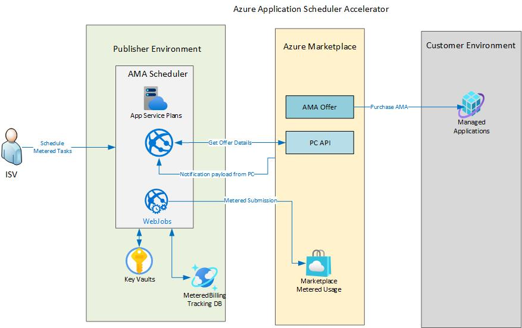

# Microsoft Commercial Marketplace - Community Code for SaaS Applications

<!-- no toc -->
- [Introduction](#introduction)
- [Intended Use](#intended-use)
- [Installation](#installation)
- [Commercial Marketplace Documentation](#commercial-marketplace-documentation)
- [Azure App Billing Scheduler Overview](#azure-app-billing-scheduler-pverview)
- [Projects](#projects)
- [Technology and Versions](#technology-and-versions)
- [Security](#security)
- [Prerequisites](#prerequisites)
- [Contributing](#contributing)
- [Developers](#developers)
- [License](#license)

## Stay current with the latest updates!

The Azure App Billing Scheduler project team releases regularly releases new versions. Please see the [release notes page](https://github.com/microsoft/azure-app-billing-scheduler/releases) for updates. We recommend keeping up to date with latest releases to stay current on security patches, bug fixes, and new features.

## Introduction

This project is a community-supported reference implementation for billling engine and scheduler solution with Microsoft commercial marketplace Azure Application offers. The Azure App Billing Scheduler may be installed as-is or may be customized to support your requirements. The project provides the following capabilities.

1. A webhook that listens for subscription notification
2. A private portal for the publisher to monitor customer subscriptions and scheduler payment
3. A billing engine to execute the scheduler payments.

The project is implemented in .NET and uses the commercial marketplace billing system, including the [PC Ingestion API](https://learn.microsoft.com/en-us/partner-center/marketplace/product-ingestion-api) and [Marketplace Metering Service API](https://docs.microsoft.com/en-us/azure/marketplace/partner-center-portal/marketplace-metering-service-apis). The Azure App Billing Scheduler models how a typical SaaS platform interacts with the marketplace APIs to provision subscriptions for customers, enable logging, and manage commercial marketplace subscriptions.

## Intended Use

This code is a reference implementation of required components of a commercial marketplace Azure App offer and complements the existing commercial marketplace documentation.

This project accelerates the Azure App offer onboarding experience for those building Azure App solutions and looking for **Metered Billing Engine** option to submit custom price model. Whether installed and used as-is or customized for your particular requirements, this reference implementation provides all main components required by a commercial marketplace Azure App offer.

> NOTE: Support for this project is community-based and contributions are welcome. Details on contributing can be found [below.](https://github.com/microsoft/azure-app-billing-scheduler#contributing). This is not an officially supported Microsoft product.

## Installation

**[Installation instructions are here](./docs/Installation-Instructions.md)**, as well as documents detailing architecture and scaled installation considerations are also available. Following these instructions will typically have the Azure App Billing Scheduler installed in 20 minutes or less.

### Monitoring

The following documents provide how-tos for setting up Azure Monitoring and Alerting for the resources deployed by the Azure App Billing Scheduler:

- [Web App Monitoring and Alerting instructions](./docs/WebApp-Monitoring.md)
- [App Registration Credentials Monitoring and Alerting instructions](./docs/WebApp-Monitoring.md)

## Commercial Marketplace Documentation

Before using this project, please review the commercial marketplace documentation resources below to understand the important concepts, account setup, and offer configuration requirements for publishing SaaS SaaS application offers.

- [Mastering the Marketplace - Azure App offers](https://aka.ms/MasteringTheMarketplace/ama). Zero-to-Hero Training on Azure Marketplace Azure App offers.
- [Commercial marketplace documentation](https://docs.microsoft.com/azure/marketplace/). Getting started and top articles
- [Azure applications in the commercial marketplace](https://learn.microsoft.com/en-us/partner-center/marketplace/azure-app-offer-setup). Overview of the Azure application business policies, plus step-by step offer creation and configuration requirements.
- [Product Ingestion API for the commercial marketplace](https://learn.microsoft.com/en-us/partner-center/marketplace/product-ingestion-api). API details for Partner Center.
- [Marketplace metering service API](https://docs.microsoft.com/azure/marketplace/partner-center-portal/marketplace-metering-service-apis). API details for the Marketplace Metering Service that enables event-based billing.

## Azure App Billing Scheduler Overview

## Projects

The source `/src` directory contains the following Visual Studio projects.

| Project | Description | Directory Name |
| --- | --- | --- |
| [**Publisher portal - Sample web application**](./src/AdminSite) | Demonstrates how to schedule usage events used in metered billing transactions, and how to emit these events to the Marketplace Metering Service API. |AdminSite|
| [**Client data access library**](./src/DataAccess) | Demonstrates how to persiste subscriptions and schedule task, and historical logging for metered usaged submissions. |DataAccess |
| [**Services client library**](./src/Services) | Contains the services used by the Customer and Publisher portals, including the POCO classes to orchestrate calls to the marketplace APIs on [client library](https://github.com/microsoft/commercial-marketplace-client-dotnet) / database.|Services |
| [**Billing Engine project**](./src/MeteredTriggerJob) | WebJob billing engine to submit metered usage. | Billing Engine |

## Technology and Versions

This project has been developed using the following technologies and versions:

- [.NET 6](https://dotnet.microsoft.com/en-us/download/dotnet/6.0)
- [ASP.NET Core Runtime 6](https://dotnet.microsoft.com/en-us/download/dotnet/6.0)
- [Entity Framework](https://docs.microsoft.com/ef/)

## Security

The accelerator code has been scanned for vulnerabilities and use secure configurations. Versions have been reviewed to ensure compatibility with the latest security guidelines.

## Prerequisites

Ensure the following prerequisites are met before getting started:

- You must have an active Azure subscription for development and testing purposes. Create an Azure subscription [here](https://azure.microsoft.com/free/).
- You must have a Partner Center account enabled for use with the commercial marketplace. Create an account [here](https://docs.microsoft.com/azure/marketplace/partner-center-portal/create-account).
- We recommend using an Integrated Development Environment (IDE):  [Visual Studio Code](https://code.visualstudio.com/),  [Visual Studio 2019 / 2022](https://visualstudio.microsoft.com/thank-you-downloading-visual-studio/?sku=Community&rel=16#), etc...
- The Azure App Billing Scheduler has been implemented using [.NET 6](https://dotnet.microsoft.com/en-us/download/dotnet/6.0)
- For data persistence we are using [Azure Cosmos Database](https://learn.microsoft.com/en-us/azure/cosmos-db/introduction) and [Entity Framework](https://docs.microsoft.com/ef/). However, feel free to use any data repository you are comfortable with.  

## Contributing

This project welcomes contributions and suggestions.  Most contributions require you to agree to a
Contributor License Agreement (CLA) declaring that you have the right to, and actually do, grant us
the rights to use your contribution. For details, visit <https://cla.opensource.microsoft.com.>

When you submit a pull request, a CLA bot will automatically determine whether you need to provide
a CLA and decorate the PR appropriately (e.g., status check, comment). Simply follow the instructions
provided by the bot. You will only need to do this once across all repos using our CLA.

This project has adopted the [Microsoft Open Source Code of Conduct](https://opensource.microsoft.com/codeofconduct/).
For more information see the [Code of Conduct FAQ](https://opensource.microsoft.com/codeofconduct/faq/) or
contact [opencode@microsoft.com](mailto:opencode@microsoft.com) with any additional questions or comments.

## Developers

Code contributed should follow the C# specifications and best practices as documented [here](https://docs.microsoft.com/en-us/dotnet/csharp/programming-guide/inside-a-program/coding-conventions).

## License

This project is released under the [MIT License](LICENSE).
