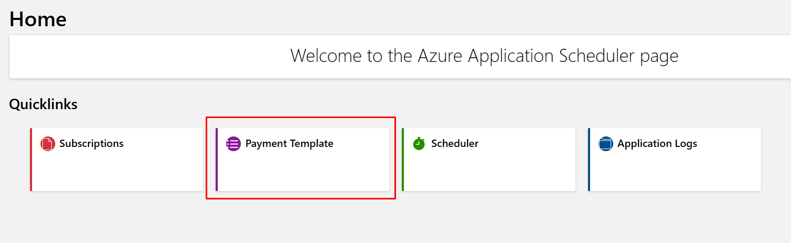
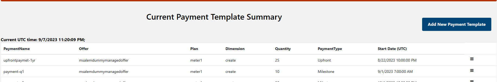
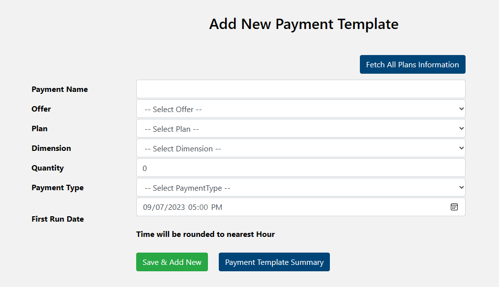
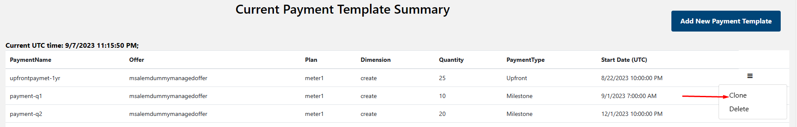
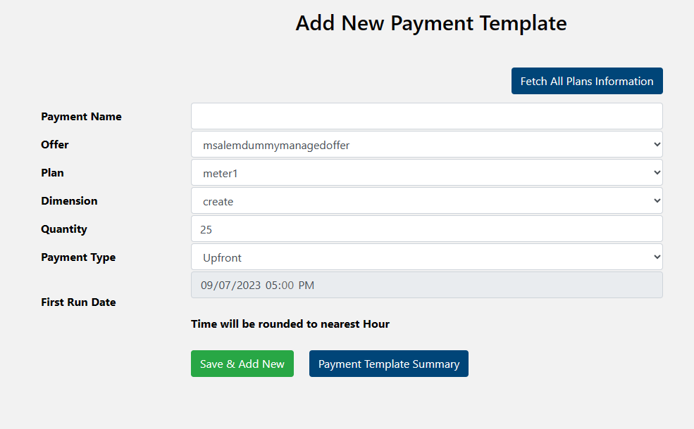
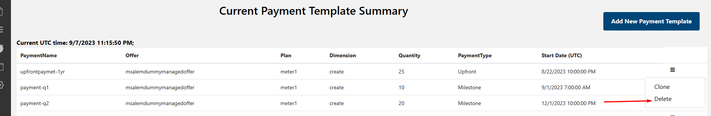

# Azure App Billing Payment Template Manager 
Publish can use Payment Template to create payment per plan in advance. When customer subscribe to a plan with payment templates, it will auto generate schedule tasks for this specific subscription.

Currentlty there are two different type of template type
1. **Upfront** payment: This type of payment will execute within 1 hour from subscription. It can be used for cases like Yearly subscription.
2. **MileStone** payment: his type of payment will execute based on specific future date once subscription is active.

## Access Payment Template Manager Dashboard
 Publisher can access **Payment Template Dashboard** from **Home page** or side bar menu.
To access the dashboad from **Home page**, Publisher will click on **Payment Template Tile** then publisher will be redirect to dashboard summary page.

## Add New Payment Template Manager Task

Publisher can add new payment template by clicking **Add New Payment Template** from **Dashboard page**

Publisher will fill the payment information based on Offer/Plan/Dim then click **Save & Add New** and the payment will be added to the Payment Template List.

## Clone Existing Payment Template Manager Task

Publisher can Clone existing payment by selecting the payment then click **Clone**

Publisher can modify the information then save new template by click **Save & Add New** and the payment will be added to the Payment Template List.

## Delete Payment Template Manager Task
Publisher can delete payment by click **Delete**

## NEXT SETP
 - [Subscription Manager](./Subscription-Manager.md)
 - [Metered Scheduler Manager](./Metered-Scheduler-Manager.md)

