# Publisher Experience

## Table of contents
  - [Table of contents](#table-of-contents)
  - [Overview](#overview)
  - [Partner Center Setup](#partner-center-setup)
  - [Manage subscriptions](#manage-subscriptions)
  - [View Metered History](#view-metered-history)
  - [Metered Scheduler Manager](./Metered-Scheduler-Manager-Instruction.md)

## Overview

The publisher web application is the admin console for the publisher for defining the input fields on the landing page and managing marketplace subscriptions.

## Partner Center Setup
1- Azure Application Billing Scheduler will deploy a **Notifaction API endpoint**. The Notification will be added to Azure Application Offer under Plan Technical Configurtation.

2- Azure Application Billing Scheduler will creat an **AAD Application**. The app will be added to Azure application offer Technical Configuration.

The app **must** be added to User Management -> App Management
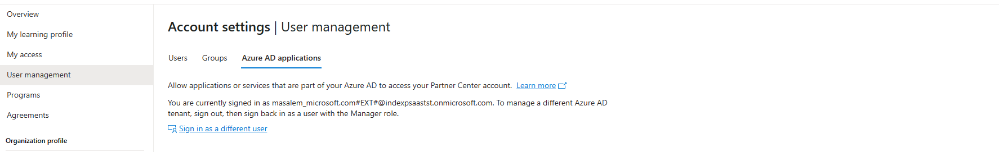

Publisher can complete the offer and publish the offer for customer to subscribe

## Manage subscriptions
Publish can managed subscription from portal subscription summary page

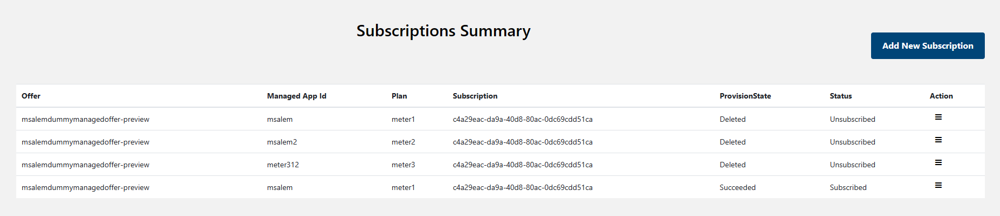

Publisher can run the following action on the subscription
### Add a subscription
In case of existing metered subscription before deploying the notification API endpoint. Publisher can add existing subscription using the **Add New Subscription**
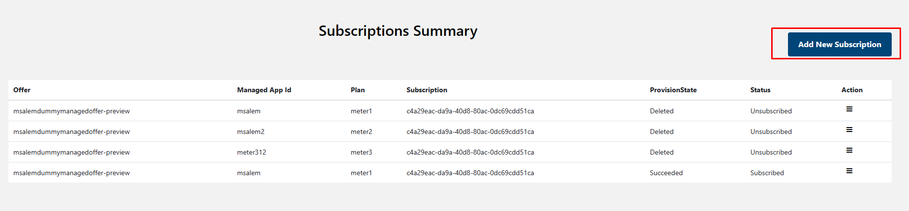

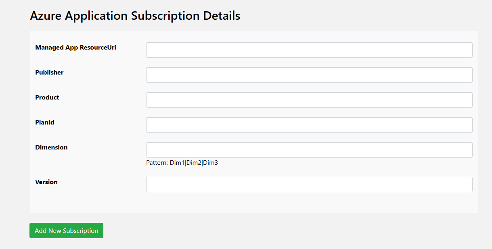

Then enter the following information
1. **Managed App ResourceUri**: This is Managed App resource ID 
1. **Publisher**: Publisher ID
1. **Product**: Offer ID
1. **PlanId**: Offer Plan ID
1. **Dimension**: Dimension list with `|` separated
1. **Version**: Plan Version

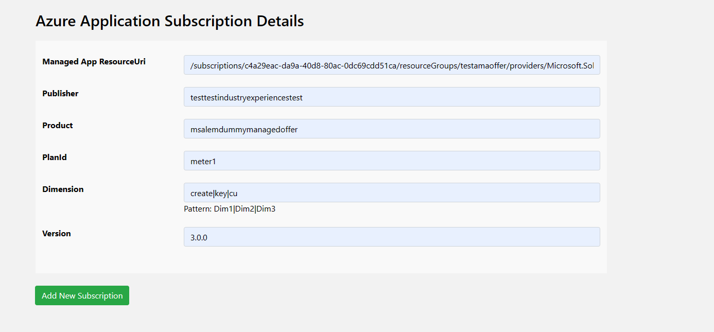

### Edit a subscription
Publisher can Edit subscription information to correct mistake or add missing information. **Edit Information** is limited

Publisher can click **Edit** from subscription dropdown list
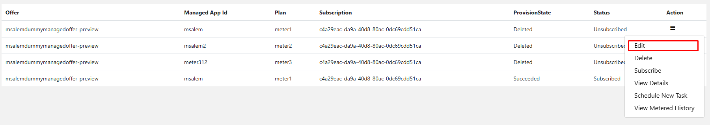

Then edit the needed information then click **Update Subscription**
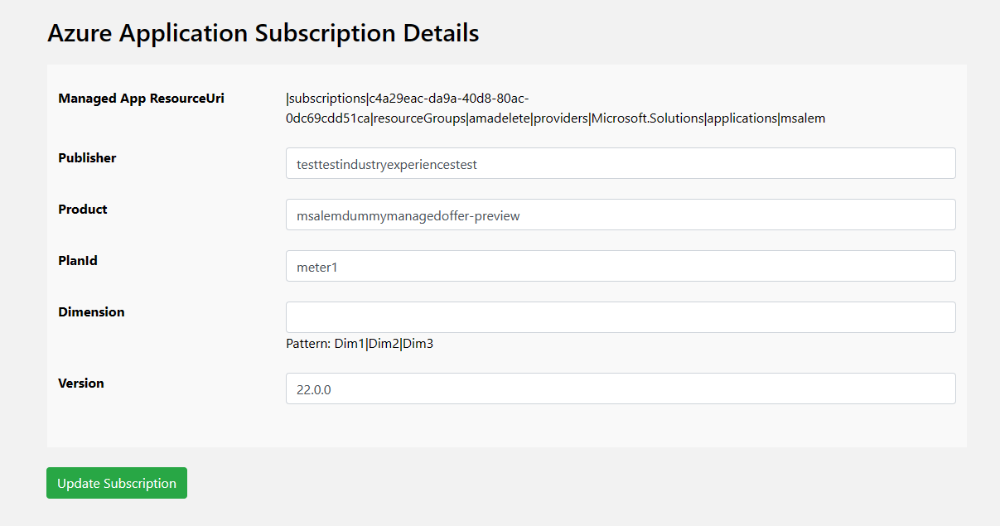

### Subscribe/Unsubscribe a subscription
Pubisher can **Unsubscribe** any active subscription. 
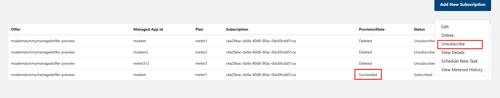

Also, If Publisher made mistake and decided to re-active subscription then Publisher can click **Subscribe** action
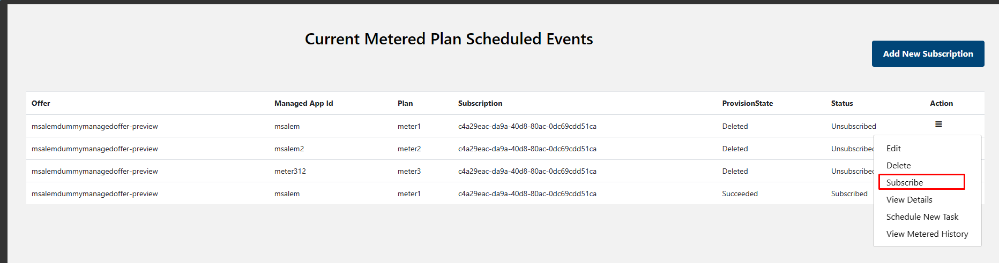

### Delete a subscription
If publisher entered subscription information by mistake and decided to delete the subscription then publisher can click **Delete** action
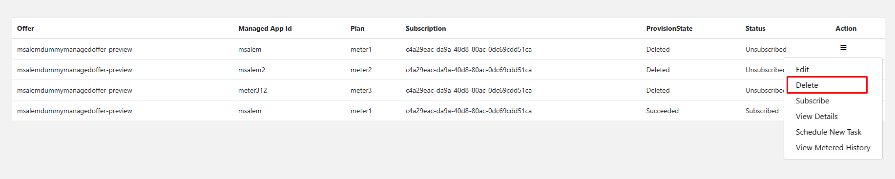

## View Metered History
Publisher can see the current metered event history by clicking on **View Metered History**

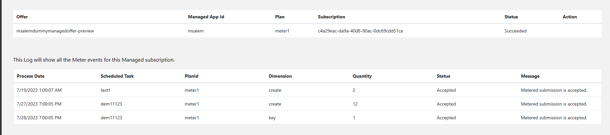

## Setup Notification Emails
Go to  **Application Config**, make sure the **SMTP** values are updated
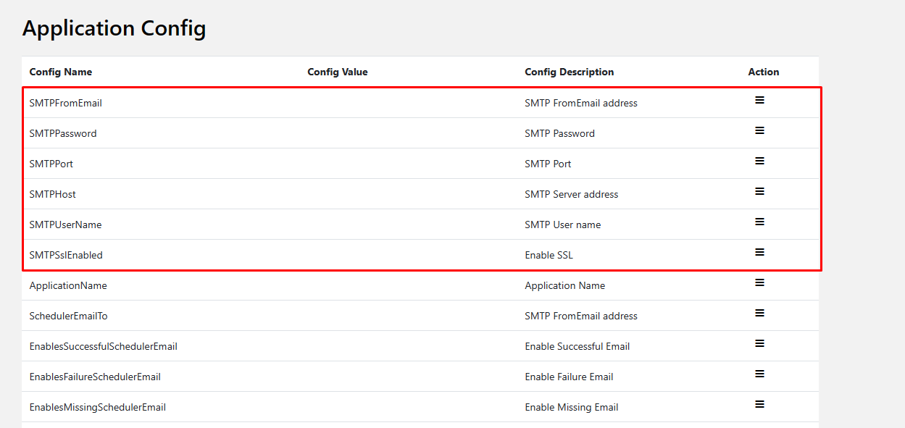

Enable Successful , Missing or Failure notification by edit the value and set it to true
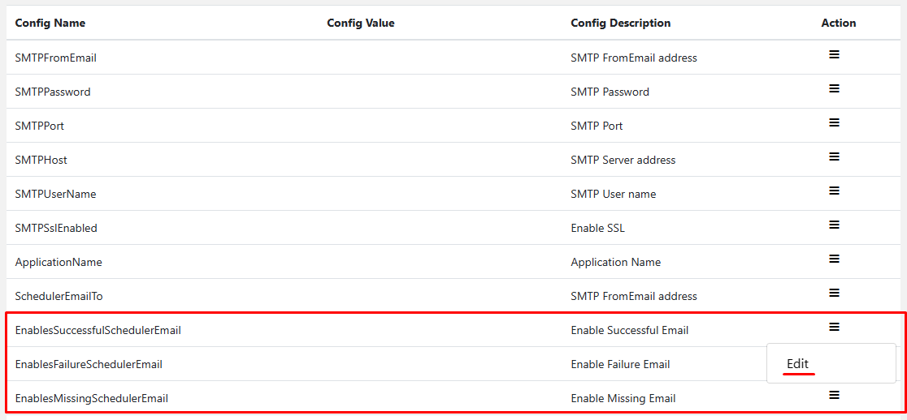

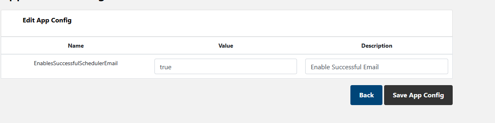
